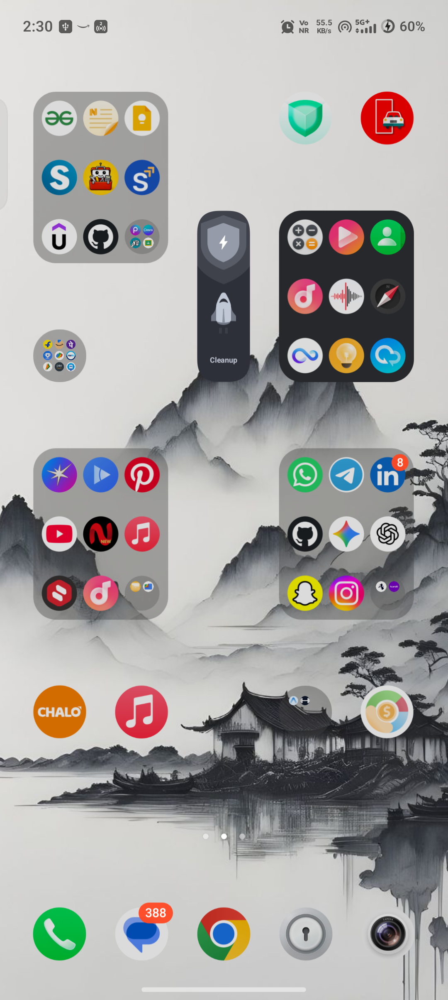

# 🏃‍♂️ Fitness & Diet Tracker

A premium, modern Android application powered by Google's Gemini AI to deliver highly personalized workout plans and nutrition schedules. Built with Jetpack Compose, Room Database, and Kotlin Coroutines.

---

## 📱 Screenshots

<div align="center">
  
</div>

---

## 📦 Pre-compiled APK
For quick installation and testing, the pre-compiled debug APK is available directly in the root of the repository:
- **[Fitness-Diet-Tracker.apk](Fitness-Diet-Tracker.apk)**

---

## 🌟 Features

*   **🤖 AI-Powered Personalization** – Smart integrations that tailors workout plans and diet regimes specifically for your physical profile and fitness goals.
*   **📋 Interactive Onboarding** – A sleek 3-step modern flow to capture:
    *   **Experience Level:** Beginner, Intermediate, or Advanced.
    *   **Fitness Goals:** Weight Loss, Muscle Building, Endurance, or general fitness.
    *   **Physical Parameters:** Tracking current weight, target weight, height, and gender.
*   **💪 Daily Expert Workout Checklist** – Fully guided daily exercises complete with duration, rest sessions, active progress bars, and custom exercise players.
*   **🍎 Diet & Nutrition Planner** – Custom meals, caloric tracking, and daily nutrition logger.
*   **📈 Dynamic Analytics** – Beautiful charts tracking your weight journey, consistency, and workout completion rates.
*   **⏰ Smart Daily Reminders** – In-app alarm and notification scheduler to keep you on track.

---

## 🛠️ Tech Stack

*   **UI Framework:** Jetpack Compose (Material Design 3)
*   **Architecture:** MVVM (Model-View-ViewModel)
*   **Database:** Room Database (Local SQLite storage)
*   **Networking:** Retrofit & OkHttp (for Gemini API calls)
*   **Concurrency:** Kotlin Coroutines & Flow
*   **Dependency injection / Secrets Management:** Secrets Gradle Plugin for Android

---

## 🚀 Getting Started & Running Locally

### Prerequisites
*   [Android Studio](https://developer.android.com/studio) (Ladybug or newer recommended)
*   Android SDK 24 (Android 7.0) or higher

### Setup & Run Instructions

1.  **Clone / Open the Project:**
    *   Open Android Studio.
    *   Select **Open** and choose the directory of this project.
    *   Wait for the Gradle sync to finish successfully.

2.  **Configure API Keys:**
    *   Create a file named `.env` in the root directory (or open the pre-created [.env](file:///.env)).
    *   Add your Gemini API Key:
        ```env
        GEMINI_API_KEY=your_actual_api_key_here
        ```
    *   *Note: Get your key from [Google AI Studio](https://aistudio.google.com/).*

3.  **Run the App:**
    *   Select your target emulator or physical device in Android Studio.
    *   Click the **Run** button (green play icon) or press `Shift + F10`.

---

## 📂 Project Structure

```
fitness/
├── app/
│   ├── src/
│   │   ├── main/
│   │   │   ├── java/com/example/             # Main Source Code
│   │   │   │   ├── data/                     # Room Entities, DAOs, and Database
│   │   │   │   ├── receiver/                 # Notifications and Alarms Receivers
│   │   │   │   ├── ui/                       # Jetpack Compose Screens & Theme
│   │   │   │   └── viewmodel/                # App ViewModels holding business logic
│   │   │   └── res/                          # Vector graphics and resources
│   │   └── test/                             # Unit & Screenshot tests
│   └── build.gradle.kts                      # Module-level Gradle configuration
├── build.gradle.kts                          # Project-level Gradle configuration
├── settings.gradle.kts                       # Gradle settings
└── .env.example                              # Env template file
```

---

*View this app in AI Studio: [AI Studio Application Link](https://ai.studio/apps/529c02a5-faab-42e7-849a-a29aff7ff918)*
